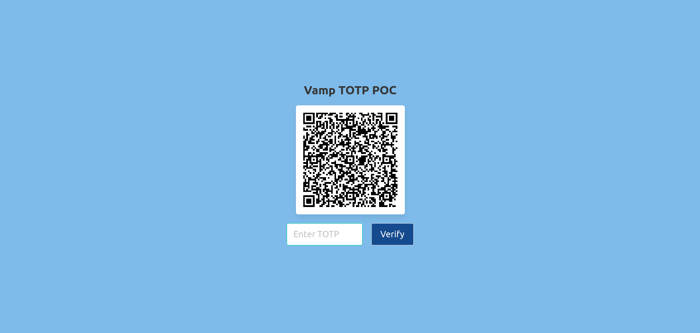

# Vamp Py TOTP POC

<a name="readme-top"></a>



## About The Project

This Proof-of-Concept (PoC) I've developed demonstrates the implementation of Multi-Factor Authentication (MFA/2FA), offering a streamlined approach to integrating MFA into web applications.

### Built With

[![Python][Python]][Python-url]&nbsp; &nbsp;[![Flask][Flask]][Flask-url]

## Getting Started

Follow the below steps in order to step this project on your local machine.

### Prerequisites

- Make sure you have python version **3.12.0** running on your local machine.

- In case you don't have python installed, go to the official website ([Python.org](https://python.org)) and install it.

### Installation

- Clone repository
```
git clone https://github.com/Guri-X/Vamp-Py-TOTP-POC.git
```

- Create a virtual environment
```
python -m venv env
```

- Activate virtual environment
```
source env/bin/activate
```

- Install requirements from **requirements.txt** file
```
pip install -r requirements.txt
```

- Create **.env** file and add your **SECRET_KEY**
```
cp .env.sample .env
```

### Execution

- Run the flask server by executing command
```
python main.py
```

<p align="right">(<a href="#readme-top">back to top</a>)</p>

## Usage

You can use any authenticator app such as google authenticator, authy, etc. After you have installed the app in your android/ios device, follow below steps to proceed:

- Scan the OR code with your app.
- Enter the 6 digit time based code generated by the app.
- You'll be alerted whether the code is correct or not.

## Contributing

This is just a PoC for now. I have some plans to develop this project more in the future. If you'll like to contribute, feel free to create a pull request.

## License

Distributed under the MIT License. See `LICENSE.txt` for more information.

## Contact

Gurvinder Singh - [@Guri_XD](https://twitter.com/Guri_XD) | 
Email - guri.developer97@gmail.com

Project Link: [https://github.com/Guri-X/Vamp-Py-TOTP-POC](https://github.com/Guri-X/Vamp-Py-TOTP-POC)

## References

- https://pyauth.github.io/pyotp/

<p align="right">(<a href="#readme-top">back to top</a>)</p>

[Python]: https://img.shields.io/badge/python-FFE467?style=for-the-badge&logo=python&logoColor=blue
[Python-url]: https://www.python.org/
[Flask]: https://img.shields.io/badge/flask-000000?style=for-the-badge&logo=flask&logoColor=white
[Flask-url]: https://flask.palletsprojects.com/